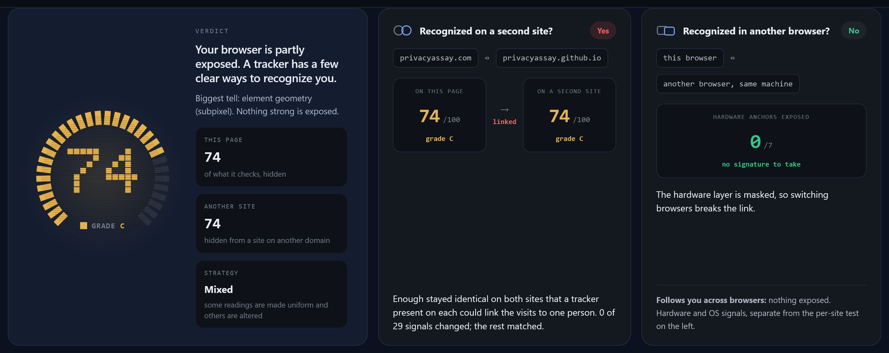
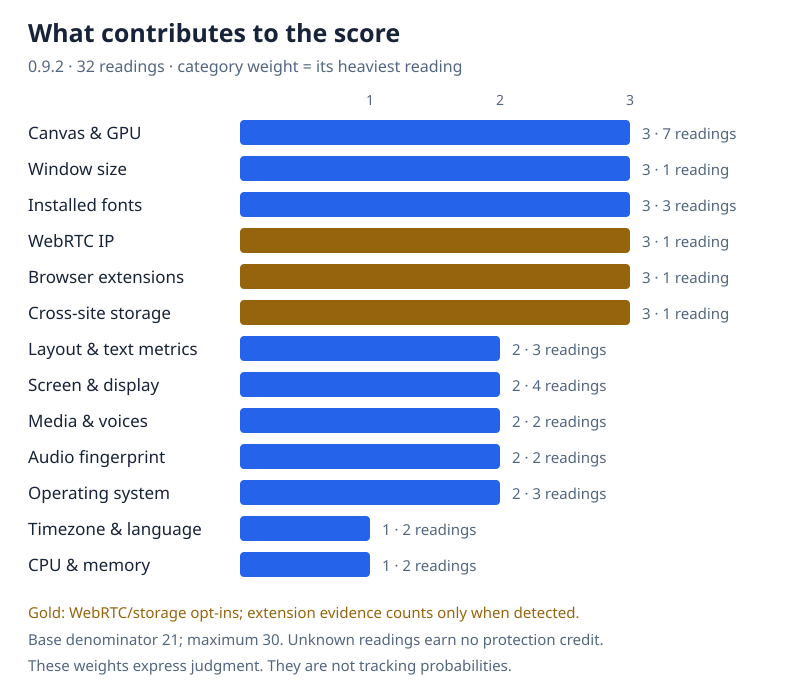

<div align="center">

<h1>
  <picture>
    <source media="(prefers-color-scheme: dark)" srcset="logo-dark.svg">
    
  </picture>
</h1>

**One HTML file that shows what a website can read about your browser and how much of it singles you out.**
Everything runs on your machine; the fingerprint is never uploaded.

[](https://github.com/seyedehsanhadi/privacyassay/actions/workflows/ci.yml)
[](package.json)
[](LICENSE)
[](package.json)

### [Open it at privacyassay.com](https://privacyassay.com)

[Results](#results) &middot; [Run it](#run-it) &middot; [Methodology](METHODOLOGY.md) &middot; [Reviewing this](#reviewing-this) &middot; [Limits](#what-it-cannot-do)

</div>



<div align="center"><sub>A real run on the hosted pair: Mullvad Browser 140.13.0, both opt-ins off, 2026-08-03. The two origins are privacyassay.com and privacyassay.github.io, separate registrable domains. Its bundled NoScript was moved aside, which is not a fingerprinting defence and does not touch resistFingerprinting. Your own result will differ.</sub></div>

---

- **One file, no build, no dependencies.** Open it, or host it anywhere static.
- **A formula you can recompute by hand** from the report it prints.
- **Says what it cannot measure** as loudly as what it can.
- **No fingerprint is uploaded.** Every reading is taken and scored in the browser. Redact is on by default, so screenshots stay safe to post.
- **Runs in CI** and fails a build below a threshold you set.

| | |
|---|---|
| **Size** | one HTML file, 276 KB |
| **Needs** | any current browser; Node 22+ for the CLI |
| **Status** | beta; the scoring model is settled, the published numbers are loopback |

Each reading is your real value (**shown**), a value every user of that browser shares or one that changes on every read (**blended**), or nothing (**refused**). The score is the share of what this tool checks that your browser hides, weighted by how identifying each reading is. It does not estimate how rare you are, which would need a population of real fingerprints. [METHODOLOGY.md](METHODOLOGY.md) has the formula and the numbers.

Redact is on by default, so values on screen and in any saved report are masked. Turn it off on the start card to see your own values. The score is identical either way.

A `<meta>` Content-Security-Policy denies everything by default. It allows this origin and the second origin the two-origin test needs, which is loopback for a local copy and `privacyassay.github.io` for the hosted one. CSP cannot govern WebRTC, which is why the STUN test is opt-in and off by default.

A copy you run yourself contacts neither of those hosts: the second origin is resolved local-first, so a file opened from disk or served on loopback pairs with loopback and reaches nothing. On the hosted copy the second origin is fetched like any page, so it sees the request the way any site you visit does. It is sent no reading; it measures in your browser and answers over `postMessage`.

## Results

One machine, Windows 11, 2026-07-31. Three runs per setting, a fresh browser launch each. Higher means more of what this tool checks is hidden.

<picture>
  <source media="(prefers-color-scheme: dark)" srcset="chart-dark.svg">
  
</picture>

| Browser | Version | Default | Range | Why it moves |
|---|---|---:|---:|---|
| Tor Browser | 140.13.0 | 74 | 74-78 | the WebRTC test adds a category it refuses outright |
| Mullvad Browser | 140.13.0 | 74 | 74-78 | same |
| LibreWolf | 152.0.6-1 | 48 | 42-55 | loses on WebRTC, gains on supercookies; one run of three did not finish that probe |
| Firefox | 153.0.1 | 9 | 8-20 | partitions storage well, which only counts when you ask for it |
| Brave | 150.1.92.144 | 5 | 4-5 | flat within a single visit by design |
| Chrome | 150.0.7871.187 | 0 | 0 | nothing hidden under any setting |
| Edge | 150.0.4078.105 | 0 | 0 | nothing hidden under any setting |

Cross-site is a separate measurement, and the only column where Brave differs from Chrome: **17 to 30 across sessions**, because it re-seeds each session and keys per site. Every other browser cross-site figure equals its single-site score.

> These ranges are not measurement noise. Within one launch and setting, six of the seven browsers returned an identical score on all three runs. The spread comes from the opt-in setting, which changes the denominator, and for LibreWolf from a probe that did not always finish, so **two scores taken under different settings cannot be compared**.

## Run it

Open `index.html` and press Run.

Three checks (request-header echo, two-origin cross-site, supercookies) need a real origin:

```bash
python serve.py
```

Serves `http://localhost:8000`, loopback only, and pairs it with `127.0.0.1` as the second origin.

Hosting it yourself works the same way for everything except those two-origin checks, which need a second host that answers back. [DEPLOY.md](DEPLOY.md) has the four steps. Until the two origins name the pair you actually serve from, the tool reports the second origin as missing rather than a result it did not measure.

## In CI

```bash
node bin/privacyassay.mjs                 # print the result as JSON
node bin/privacyassay.mjs --min-score 40  # and fail below a threshold
```

Headless, fresh browser per run so a farbling browser cannot re-use one seed. It serves `127.0.0.1` and `localhost` from one handler, so it reports the two-origin cross-site figure as well; `--no-cross` skips it. Needs Node 22+ and a Chromium-family browser. Set the threshold against the browser CI runs: a stock Chromium scores near zero.

## Reviewing this

The whole tool is `index.html`, one file. Sections are marked `/* TITLE ==== */` and subsections `/* - detail ---- */`, so both levels scan as their own column down the file. There are no other comments: the reason behind each fix lives in the test that pins it. What decides a score:

| What | Where |
|---|---|
| The scored catalog and its weights | `PRIORS` |
| Reading to shown / blended / refused | `findability` |
| The two-origin comparison | `findabilityCross` |
| What a shared report may contain | `paRedactVal` |

```bash
npm test              # scoring arithmetic, every classifier branch, catalog consistency, docs against code
npm run test:browser  # a real browser, including deliberate probe sabotage
npm run test:stress   # repeated runs, re-entrancy, viewport extremes
```

A refused reading is credited as protection, so a broken probe would raise the score. The browser suite breaks each probe on purpose and asserts it never scores as a value handed over.

## What it cannot do

- **Tell you how rare you are in the real world.** That needs a live population; the weights are judgment, not measured rarity.
- **See the network layer.** TLS, HTTP/2, TCP and DNS are sent before any script runs.
- **See behaviour.** Mouse, typing and scroll are not measured.
- **Give a real cross-site figure from a local copy.** Run locally, the two-origin test pairs `localhost` with `127.0.0.1`, which browsers treat more permissively than two registered domains. The hosted copy pairs two real sites, but the benchmark serves the file itself and reads the result back over its own connection, so it can only measure the loopback pair: every number published here was measured that way.

A high score means most of what it checks is hidden, not that you are anonymous.

## Prior art

Browser fingerprinting has been measured in public for years, and this tool is not the first to do it.

[EFF Cover Your Tracks](https://coveryourtracks.eff.org/) estimates how rare your browser is against a live population, which is the one thing measured here cannot do. [privacytests.org](https://privacytests.org/) tests browsers rather than the visitor, across a far wider matrix than seven. [CreepJS](https://abrahamjuliot.github.io/creepjs/) reads more surfaces than this does and is the reference for lie detection.

What is different here is the combination: one file with no build, a score whose arithmetic you can recompute by hand from the report, and a stated refusal to guess at anything it could not measure.

## Contributing

Issues and pull requests are welcome, particularly a browser this scores wrongly: say which reading it got wrong and what the browser actually returns.

Two things the suite enforces, so they are worth knowing before you open a pull request. `index.html` carries section markers and no other comments, because the reason behind a fix belongs in the test that pins it. And any number stated in prose is checked against the code that produces it, so a value changed in one place fails the build in the other.

```bash
npm test && npm run test:browser && npm run test:stress
```

## Security

[SECURITY.md](SECURITY.md) has what is in scope and how to report privately.

## License

Apache-2.0, &copy; Seyed Ehsan Hadi. See [`LICENSE`](LICENSE) and [`NOTICE`](NOTICE).
