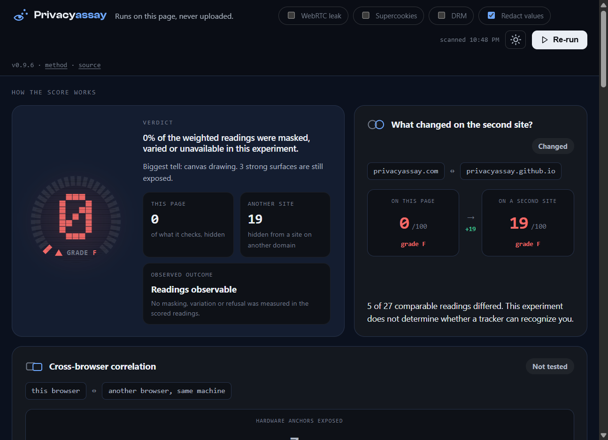
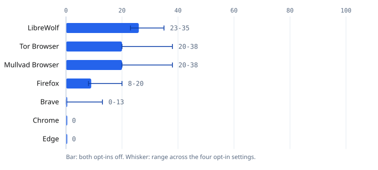

<div align="center">

<h1>
  <picture>
    <source media="(prefers-color-scheme: dark)" srcset="logo-dark.svg">
    
  </picture>
</h1>

**One HTML file that shows what a website can read about your browser and how much of it your browser hides.**
Everything runs on your machine; the fingerprint is never uploaded.

[](https://github.com/seyedehsanhadi/privacyassay/actions/workflows/ci.yml)
[](package.json)
[](LICENSE)
[](package.json)

### [Open it at privacyassay.com](https://privacyassay.com)

[Results](#results) &middot; [Run it](#run-it) &middot; [Methodology](methodology.html) &middot; [Reviewing this](#reviewing-this) &middot; [Limits](#what-it-cannot-do)

</div>



<div align="center"><sub>Brave 154, 0.9.5, both opt-ins off, 2026-10-06, hosted pair. Your result will differ.</sub></div>

---

- **One file, no build, no dependencies.** Open it, or host it anywhere static.
- **A formula you can recompute by hand** from the report it prints.
- **Says what it cannot measure** as loudly as what it can.
- **No fingerprint is uploaded.** Every reading is taken and scored in the browser. Redact is on by default, so screenshots stay safe to post.
- **Runs in CI** and fails a build below a threshold you set.

| | |
|---|---|
| **Size** | one HTML file, 286 KB |
| **Needs** | any current browser; Node 22+ for the CLI |
| **Status** | 0.9.5; failed readings stay unknown; canvas compared on pixels |

Each reading is your real value (**shown**), an observed mask or repeated variation (**blended**), an unsupported or explicitly denied API or completed test with nothing exposed (**refused**), or a missing, invalid or failed measurement (**unknown**). On the cross-site score a reading also counts as hidden when a Tor, Mullvad or resistFingerprinting browser reports its family's fixed value on both sites, which separates uniformity from randomization. Unknown readings earn no credit; incomplete runs show grade **I**, coverage and score bounds. The score is the share of what this tool checks that your browser hides, weighted by how identifying each reading is. It does not estimate how rare you are, which would need a population of real fingerprints. [METHODOLOGY.md](METHODOLOGY.md) has the formula and the numbers.

Redact is on by default, so values on screen and in any saved report are masked. Turn it off on the start card to see your own values. The score is identical either way.

A `<meta>` Content-Security-Policy denies everything by default. It allows this origin and the second origin the two-origin test needs, which is loopback for a local copy and `privacyassay.github.io` for the hosted one. CSP cannot govern WebRTC, which is why the STUN test is opt-in and off by default. DRM key systems are opt-in too, because requesting them can make the browser show a permission or install prompt.

A copy you run yourself contacts neither of those hosts: the second origin is resolved local-first, so a file opened from disk skips the comparison and a loopback copy pairs only with loopback. On the hosted copy the second origin is fetched like any page, so it sees the request the way any site you visit does. It is sent no reading; it measures in your browser and answers over `postMessage`.

## Results

One machine, Windows 11, 2026-10-06, 0.9.5 measured on the hosted pair (`privacyassay.com` against `privacyassay.github.io`). Two runs per setting, a fresh profile each. Two sites let the tool credit both kinds of protection: values that differ between the sites (randomizers) and a family's fixed values that match on both (uniformizers). The score that uses both is the cross-site score. Higher means more of what this tool checks is hidden.

<picture>
  <source media="(prefers-color-scheme: dark)" srcset="chart-dark.svg">
  
</picture>

| Browser | Version | Cross-site | Range | Single-site |
|---|---|---:|---:|---:|
| Tor Browser | 140.17.0 | 57 | 57-67 | 20 |
| Mullvad Browser | 140.17.0 | 57 | 57-67 | 20 |
| LibreWolf | 152.0.6-1 | 46 | 40-52 | 26 |
| Brave | 154.1.96.61 | 19 | 16-34 | 0 |
| Firefox | 154.0.1 | 9 | 8-20 | 9 |
| Chrome | 154.0.8037.92 | 0 | 0 | 0 |
| Edge | 154.0.4258.37 | 0 | 0 | 0 |

Range is the spread across the four opt-in settings (supercookies, WebRTC), which change the denominator; scores from different settings cannot be compared. The single-site score never earns uniformity credit, which is why Tor and Mullvad read lower there. Brave re-seeds per session, so its cross-site score varies between runs. Installed fonts are not credited for any browser, because the tool cannot verify the bundled set. Tor and Mullvad were measured with NoScript moved aside. Raw captures are in `bench/captures/`. Scores are not comparable with 0.9.4 or earlier.

## Run it

Open `index.html` and press Run.

Three checks (request-header echo, two-origin cross-site, supercookies) need a real origin:

```bash
python serve.py
```

Serves `http://127.0.0.1:8000`, loopback only, and pairs it with `localhost` as the second origin, which needs `localhost` to resolve to the address it binds.

Hosting it yourself works the same way for everything except those two-origin checks, which need a second host that answers back. [DEPLOY.md](DEPLOY.md) has the four steps. Until the two origins name the pair you actually serve from, the tool reports the second origin as missing rather than a result it did not measure.

## In CI

```bash
node bin/privacyassay.mjs                 # print the result as JSON
node bin/privacyassay.mjs --min-score 40  # and fail below a threshold
```

Headless, fresh browser per run so a farbling browser cannot re-use one seed. It serves `127.0.0.1` and `localhost` from one handler, so it reports the two-origin cross-site figure as well; `--no-cross` skips it. Needs Node 22+ and a Chromium-family browser. Set the threshold against the browser CI runs: a stock Chromium scores near zero. Incomplete runs fail `--min-score`; summary exports use `privacyassay-summary/1.1`.

## Reviewing this

The whole tool is `index.html`, one file. Sections are marked `/* TITLE ==== */` and subsections `/* - detail ---- */`, so both levels scan as their own column down the file. Regression tests record the behavior each fix must preserve. What decides a score:

| What | Where |
|---|---|
| The scored catalog and its weights | `PRIORS` |
| Reading to shown / blended / refused / unknown | `findability` |
| The two-origin comparison | `findabilityCross` |
| What a shared report may contain | `paRedactVal` |

```bash
npm test              # scoring arithmetic, every classifier branch, catalog consistency, docs against code
npm run test:browser  # a real browser, including deliberate probe sabotage
npm run test:stress   # repeated runs, re-entrancy, viewport extremes
```

A confirmed refused reading receives credit; a broken probe stays unknown and receives none. The browser suite deliberately breaks probes and checks that failures never become shown values or protection credit.

## What it cannot do

- **Tell you how rare you are in the real world.** That needs a live population; the weights are judgment, not measured rarity. Uniformity credit covers only the fixed values of Tor, Mullvad and resistFingerprinting browsers, so a browser outside that list that hides you by blending in is understated.
- **See the network layer.** TLS, HTTP/2, TCP and DNS are sent before any script runs.
- **See behaviour.** Mouse, typing and scroll are not measured.
- **Give a real cross-site figure from a local copy.** Run locally, the two-origin test pairs `localhost` with `127.0.0.1`, which browsers treat more permissively than two registered domains: Brave, for one, carries cookies across that pair but blocks them between real sites. The table above comes from `bench/live.mjs`, which drives each browser against the hosted pair.

- **Audit browser AI settings or every privacy defense.** AI API availability cannot establish Firefox AI Controls or assistant data handling. Telemetry, comprehensive tracker blocking and all-browser compatibility are outside this score.

A high score means most of what it checks is hidden, not that you are anonymous.

## Prior art

Browser fingerprinting has been measured in public for years, and this tool is not the first to do it.

[EFF Cover Your Tracks](https://coveryourtracks.eff.org/) estimates how rare your browser is against a live population, which is the one thing measured here cannot do. [privacytests.org](https://privacytests.org/) tests browsers rather than the visitor, across a far wider matrix than seven. [CreepJS](https://abrahamjuliot.github.io/creepjs/) reads more surfaces than this does and is the reference for lie detection.

What is different here is the combination: one file with no build, a score whose arithmetic you can recompute by hand from the report, and a stated refusal to guess at anything it could not measure.

## Contributing

The most useful thing you can send is a browser this scores wrongly, and there is a form for it under New issue. Disagreeing with the method is just as welcome. [CONTRIBUTING.md](CONTRIBUTING.md) has the two conventions the test suite enforces.

## Security

[SECURITY.md](SECURITY.md) has what is in scope and how to report privately.

## License

Apache-2.0, &copy; Seyed Ehsan Hadi. See [`LICENSE`](LICENSE) and [`NOTICE`](NOTICE).
